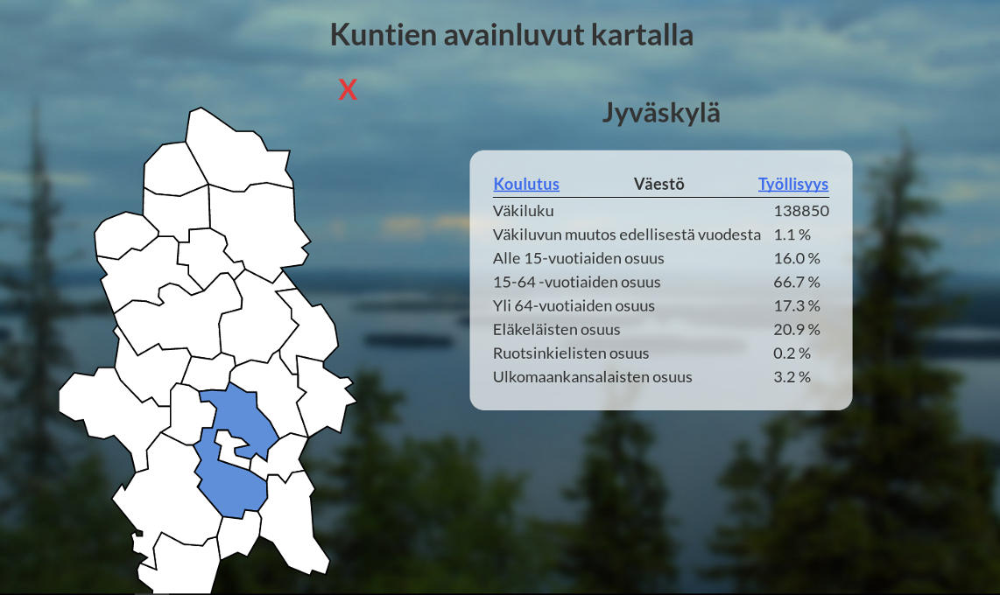
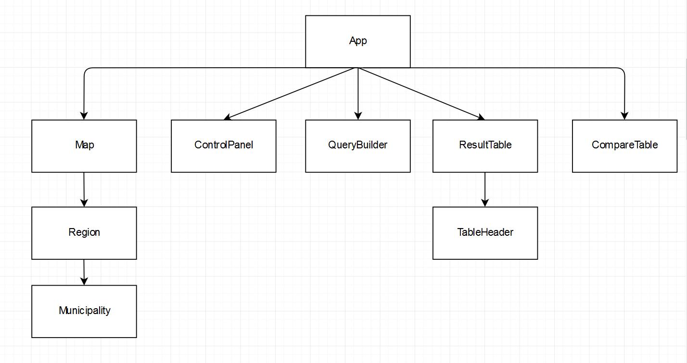
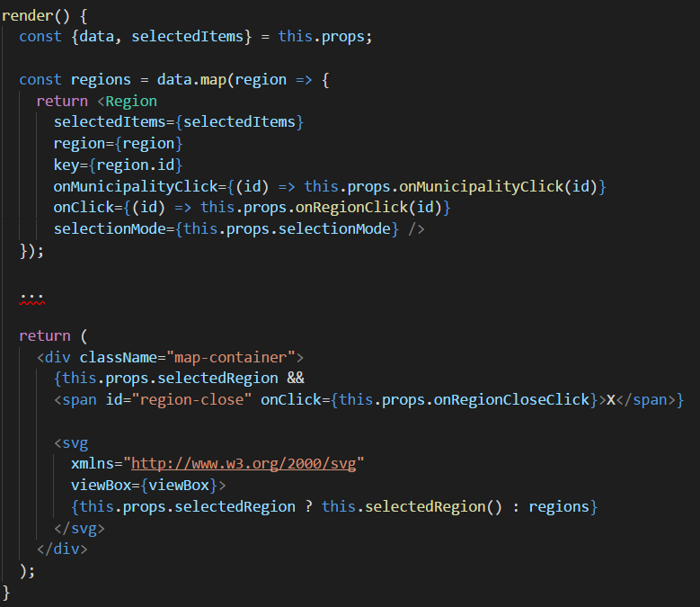
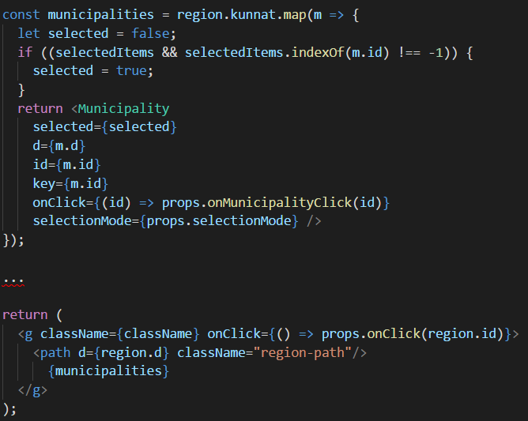
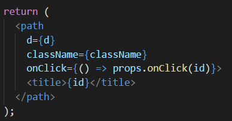

# Kuntakartta
## Suomen avainluvut kartalla
30.11.2017  
Teemu Tuomela H8705  
TTMS0500 Web-ohjelmointi  

Sovellus on nähtävillä DigitalOcean:in palvelimella osoitteessa:
[http://146.185.183.122/](http://146.185.183.122/)

## Yleiskuvaus


Kuntakartta-sovelluksella käyttäjä voi hiirellä klikkaamalla valita niin maakunta kuin kuntatasolla tarkasteltavan kohteen. Klikattaessa kohdetta, kohteen tiedot haetaan dynaamisesti palvelimelta. Valitun kohteen avainluvut esitetään kartan vierellä taulukossa. Taulukosta käyttäjä voi tarkastella lukuja jaoteltuina kategorioihin koulutus, väestö ja työllisyys.  

Käyttöliittymästä löytyy nappeja, joilla käyttäjä voi suorittaa muutamia ennaltamääritettyjä kyselyitä, kuten "Väkiluvultaa suurimmat kunnat" ja "Huonoin työllisyysaste". Näiden kyselyiden tulokset väritetään kartalle ja tulokset esitetään vertailussa kartan vierellä.  

Käyttäjän on myös mahdollista luoda rajatuin ehdoin omia kyselyitä, joiden tulokset esitetään ylläkuvatulla tavalla.  

Esitettävä data on haettu tilastokeskuksen avoimesta rajapinnasta csv-muodossa, josta rakensin tätä sovellusta varten relaatiotietokannan.  

Käyttöliittymä on toteutettu React-kirjastolla ja se löytyy frontend kansiosta. Palvelintoteutus on toteutettu Node.js + express.js pohjalta ja se löytyy backend kansiosta. Tietovarastona toimii PostgreSQL tietokanta. Tietokannan luontitiedosto init.sql löytyy repositorion juuresta.  

## Sovelluksen rakenne



Sovelluksen kokoaa App-komponentti. Tämä komponentti sisältää sovelluksen tilan state-muuttujassa sekä huolehtii ajax-kutsujen suorittamisesta ja niistä saadun datan välittämisestä alemmille komponenteille esitettäväksi. Alemmille komponenteille välitetään takaisinkutsufunktioita, joiden avulla tieto käyttäjän toiminnoista välitetään ylös App-komponentille.  

* Map-komponentti hyödyntää Region- sekä Municipality komponentteja kartan piirtämiseen.
* ControlPanel sisältää nappeja, joilla voidaan suorittaa ennaltamääritettyjä kyselyitä.
* QueryBuilder sisältää lomakkeen, jolla käyttäjä voi rakentaa rajatuin ehdoin omia kyselyitään.
* ResultTable esittää valitun kohteen tiedot kategorioihin jaetussa taulukossa.
* CompareTable esittää tiedot, kun suoritetaan kysely, joka voi palauttaa useamman kuin yhden tuloksen.

## Kartan piirto
Map-komponentti hoitaa kartan piirtämisen. Kartta piirretään svg-elementtinä. Path-elementtien d-attribuutti määrittää polun piirtämiseen käytetyn tiedon. Nämä tiedot luetaan data.json tiedostosta. Map-komponentti luo svg-elementin ja luo sen sisälle Region-komponentit (maakunnat).  



Region-komponentit luovat g-elementin ja sen sisälle omat rajansa path-elementtinä sekä kunnat Municipality-komponentteina.  



Municipality-komponentin tehtäväksi jää ainoastaan piirtää omat kuntarajansa path-elementtinä.  



## Itsearvio
Ehdotan harjoitustyölle arvosanaa 5.  

Olen työn lopputulokseen erittäin tyytyväinen ja toteutus onnistui hieman odotettua helpommin. Aikaa toteutukseen käytettiin noin 34 tuntia. Erityisesti kartan toiminnallisuuden toteutus onnistui jouhevasti, sillä svg:n sisältämät elementit tukevat hyvin osoittimen tapahtumia. Myös React rakentaa elementit nopeasti luetun datan mukaan ja piirto on kaikin puolin sulavaa.  

Lähdekoodin rakenne on mielestäni selkeä ja hyvin jaoteltu. Uusien ominaisuuksien kuten kunnan tai maakunnan haku nimellä olisi nopea lisätä nykyiseen toteutukseen.  

Käyttöliittymän reponsiivisuuteen en ehtinyt paneutua. Käyttöliittymä ei nykyisellään ole pienellä näytölle käytettävä.  

## Asennus
Tämän projektin kehitysympäristön asennus onnistuu helposti, mikäli sinulla on asennettuna docker sekä docker-compose. Huomaa kuitenkin, että ympäristön asennus vie useamman sataa megatavua levytilaa. Projekti on luotu create-react-app työkalulla, joka asentaa node_modules kansioon kaikenlaista ylimääräistä ~200MB arvosta. Myös PostgreSQL kontti yksissään on ~300MB. Käyttöliittymä ja palvelin käyttävät mhart/alpine-node konttia, joka on 66,3MB.  

Kloonaa repositorio, siirry hakemiston juureen ja suorita docker-compose.yml komennolla
```
docker-compose up
```
docker-compose rakentaa kolme konttia: yhden käyttöliittymälle, yhden palvelimelle sekä yhden tietokannalle. Kontit käynnistyvät automaattisesti, jonka jälkeen voit siirtyä selaimella osoitteeseen localhost:3000.  

Muutokset frontend/src sekä backend/src kansioiden tiedostoihin päivittävät sovellusta välittömästi tallennuksen jälkeen ilman tarvetta käynnistää sovellusta uudelleen.  

Asennetut kontit voi poistaa komennolla
```
docker-compose down --rmi all
```
